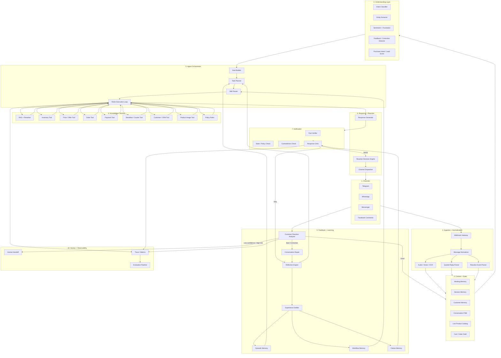
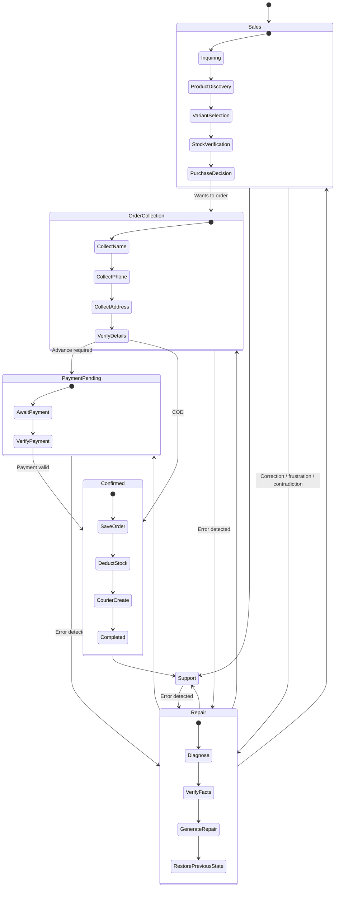

# Adaptive Omnichannel E-Commerce Agent — Architecture V2

> Upgrade blueprint for an existing Telegram + WhatsApp + Facebook Messenger + Facebook Comment e-commerce agent.
>
> Goal: evolve the system from a prompt-driven commerce bot into an adaptive, self-correcting, tool-grounded agent that can plan, act, verify, recover from bad replies, learn reusable workflows from experience, and react appropriately to customer messages/comments.

---

## 1. Version 2 Goals

The upgraded agent should be able to:

- Understand customer intent, entities, sentiment, frustration, corrections, and buying intent.
- Maintain structured conversation state instead of relying only on raw chat history.
- Plan multi-step actions before responding.
- Use tools iteratively: reason → act → observe → re-plan.
- Verify price, stock, payment, order status, delivery, and policy from authoritative sources.
- Critique its own response before sending.
- Detect when the customer disliked, corrected, or misunderstood the previous response.
- Automatically repair the conversation without restarting the sales flow.
- React to messages/comments with supported channel reactions when useful.
- Learn reusable lessons and workflows from successful/failed conversations.
- Store high-quality feedback for future prompt/RAG/skill/fine-tuning improvements.
- Escalate to a human when confidence is low or the situation is high-risk.
- Evaluate success using real business outcomes, not only sentiment.

---

# 2. Upgraded High-Level Architecture



---

# 3. Core Runtime Pattern: ReAct-Style Agent Loop

The current system should not stop at:

```text
Message → Gemini → Tags → Execute → Reply
```

Upgrade to:

```text
Message
  ↓
Understand
  ↓
Build goal
  ↓
Plan
  ↓
Choose skill
  ↓
Choose tool
  ↓
Execute
  ↓
Observe result
  ↓
Re-plan if needed
  ↓
Generate response
  ↓
Critic verifies
  ↓
Send
```

## Example

Customer:

```text
Black XL 2 ta nibo. Dhaka delivery including total koto?
```

Internal plan:

```json
{
  "goal": "calculate_purchase_total",
  "known": {
    "color": "black",
    "size": "XL",
    "quantity": 2,
    "delivery_area": "Dhaka"
  },
  "required_actions": [
    "check_inventory",
    "get_current_price",
    "calculate_delivery_fee",
    "calculate_total"
  ],
  "success_condition": "customer receives verified total and availability"
}
```

Execution:

```text
check_inventory(black, XL, 2)
→ available=true, stock=7

get_current_price(product_id)
→ unit_price=490

calculate_delivery_fee(Dhaka)
→ fee=80

calculate_total(490, 2, 80)
→ 1060
```

Only then generate the final answer.

---

# 4. Skill System

Avoid one giant prompt. Split behavior into reusable skills.

```text
skills/
├── greeting/
├── product-discovery/
├── product-recommendation/
├── stock-check/
├── price-and-offer/
├── order-collection/
├── payment-verification/
├── delivery-tracking/
├── return-and-exchange/
├── complaint-resolution/
├── conversation-repair/
├── customer-retention/
├── facebook-comment/
└── human-handoff/
```

Example `stock-check/SKILL.md`:

```md
# Stock Check Skill

## Goal
Give accurate live availability for a requested SKU/variant.

## Required behavior
- Never answer stock from memory.
- Always call the live inventory tool.
- Resolve product + color + size first.
- If a variant is unavailable, offer valid alternatives only.
- Do not invent stock counts.
- Preserve current sales state.

## Required tools
- search_product
- check_inventory
- get_product_variants

## Success
Customer receives verified availability and the conversation continues naturally.
```

---

# 5. Understanding Layer

Each incoming customer event should create a structured interpretation.

```json
{
  "intent": "PRODUCT_AVAILABILITY",
  "entities": {
    "product": "Premium T-Shirt",
    "color": "Black",
    "size": "XL",
    "quantity": 1
  },
  "sentiment": "neutral",
  "frustration": 0.08,
  "customer_correction": false,
  "repeated_question": false,
  "purchase_intent": 0.71,
  "confidence": 0.95
}
```

Recommended classifications:

### Intent
- GREETING
- PRODUCT_DISCOVERY
- PRODUCT_INFO
- PRICE_QUERY
- STOCK_QUERY
- PRODUCT_RECOMMENDATION
- ORDER_START
- ORDER_CHANGE
- ORDER_TRACKING
- PAYMENT_QUERY
- DELIVERY_QUERY
- RETURN_REQUEST
- EXCHANGE_REQUEST
- COMPLAINT
- HUMAN_REQUEST
- UNKNOWN

### Feedback Signals
- CUSTOMER_CORRECTION
- AGENT_MISUNDERSTANDING
- REPEATED_QUESTION
- CONTRADICTION
- CONFUSION
- FRUSTRATION
- NEGATIVE_REACTION
- POSITIVE_CONFIRMATION
- ABANDONMENT_RISK

---

# 6. Conversation State Machine V2



### Important Rule

`Repair` is a temporary state.

Never restart the entire flow because the agent made one mistake.

Store:

```json
{
  "previous_state": "VariantSelection",
  "temporary_state": "Repair"
}
```

After repair:

```text
Repair → VariantSelection
```

---

# 7. Pre-Response Critic

Before sending any important response, evaluate it.

## Critic checks

```text
1. Did we answer the actual customer question?
2. Are product and variant correct?
3. Is stock tool-grounded?
4. Is price tool-grounded?
5. Is delivery information tool-grounded?
6. Does the answer contradict earlier verified facts?
7. Are we repeating a question already answered?
8. Did we follow the current FSM state?
9. Did we violate a business rule?
10. Are we claiming an action succeeded before tool confirmation?
```

Example critic output:

```json
{
  "pass": false,
  "issues": [
    {
      "type": "UNVERIFIED_STOCK_CLAIM",
      "severity": "high"
    }
  ],
  "required_fix": "call check_inventory before replying"
}
```

---

# 8. Customer Reaction + Feedback Analyzer

Every new customer message must also evaluate the previous agent response.

Input:

```text
previous_customer_message
+
previous_agent_response
+
current_customer_message
+
current_state
+
tool_observations
```

Output:

```json
{
  "satisfaction": "negative",
  "sentiment": "frustrated",
  "customer_corrected_agent": true,
  "agent_misunderstood": true,
  "possible_wrong_fact": true,
  "repeated_question": false,
  "severity": "medium",
  "confidence": 0.93
}
```

Examples that should trigger repair:

```text
না, আমি এটা বলি নাই
wrong
ভুল বলছেন
website e onno price
abar same kotha bolchen
bujhen nai
eta na
ami blue bolsi
human er sathe kotha bolbo
```

Do not rely only on keywords. Use semantic analysis.

---

# 9. Conversation Repair Engine

```text
Negative/corrective customer reaction
        ↓
Classify failure
        ↓
Find root cause
        ↓
Determine authoritative source
        ↓
Re-check fact/tool
        ↓
Generate concise correction
        ↓
Return to previous conversation state
```

Possible error types:

```text
MISUNDERSTOOD_INTENT
WRONG_PRODUCT
WRONG_VARIANT
WRONG_PRICE
WRONG_STOCK
WRONG_DELIVERY_INFO
WRONG_ORDER_STATUS
WRONG_PAYMENT_STATUS
MISSED_QUESTION
REPEATED_QUESTION
CONTRADICTED_PREVIOUS_REPLY
TOO_GENERIC
CUSTOMER_CONFUSED
CUSTOMER_FRUSTRATED
TOOL_FAILURE
RAG_FAILURE
STATE_ERROR
POLICY_ERROR
```

Example:

```text
Customer:
Black XL ache?

Agent:
Sorry, নেই.

Customer:
Website e available dekhacche.

→ Feedback: correction
→ Reflection: stock answer was not grounded
→ Action: check_inventory(black, XL)
→ Observation: stock=7
→ Repair:
"You're right—Black XL is currently available. My previous reply was incorrect. Would you like one piece or more?"
```

---

# 10. Message / Comment Reaction Engine

The agent can optionally react to customer messages/comments where the channel supports it.

## Goal

Use reactions as a lightweight social signal, not as a replacement for a real answer.

## Reaction categories

```text
ACKNOWLEDGEMENT
POSITIVE
APPRECIATION
CELEBRATION
EMPATHY
NO_REACTION
```

## Suggested reaction policy

| Customer message | Suggested behavior |
|---|---|
| “Thanks” / “ধন্যবাদ” | 👍 / ❤️ if supported |
| “Order korbo” | ❤️ or 👍 + continue order flow |
| Positive product feedback | ❤️ |
| Customer confirms details | 👍 |
| Complaint | Do not use cheerful reaction; reply properly |
| Angry/frustrated message | Usually no reaction; repair first |
| Payment screenshot | No reaction before verification |
| Sensitive support issue | No reaction |
| Public FB comment asking price | Optional 👍 then concise public reply/DM |
| Spam/abuse | No positive reaction |

## Reaction decision object

```json
{
  "should_react": true,
  "reaction_type": "LIKE",
  "reason": "customer confirmed order details",
  "confidence": 0.94
}
```

## Channel Adapter

```text
ReactionDecision
    ↓
ChannelCapabilityCheck
    ↓
Telegram reaction API / supported reaction
WhatsApp supported message reaction
Messenger supported reaction
Facebook comment reaction/like where API permissions allow
    ↓
Success/failure logged
```

### Important

Reaction capability varies by platform/API version and permissions.

Always:

```text
check_channel_capability()
```

before attempting a reaction.

If unsupported:

```text
skip reaction
```

Never fail the customer reply because a reaction failed.

---

# 11. Facebook Comment Intelligence

Facebook comments need separate behavior from private chat.

## Comment types

```text
PUBLIC_PRODUCT_QUERY
PRICE_QUERY
STOCK_QUERY
POSITIVE_COMMENT
NEGATIVE_COMMENT
COMPLAINT
ORDER_PRIVATE_INFO
SPAM
HUMAN_REQUEST
```

## Public/private decision

```text
Comment
  ↓
Contains private order/payment/customer data?
  ├── Yes → move to DM
  └── No
       ↓
Can answer safely in public?
  ├── Yes → public reply
  └── No → DM
```

Example:

```text
Comment:
price koto?

Public:
"Current price is ৳490. I can also send you available colors and sizes in Messenger."
```

Example:

```text
Comment:
amar order ekhono ashe nai order 81722

Public:
"আপনাকে ইনবক্সে সাহায্য করছি।"

→ DM
→ verify customer/order
→ give tracking information
```

---

# 12. Memory Architecture

Do not rely only on a 24-hour raw chat window.

```text
MEMORY
│
├── Working Memory
│   └── last few messages + latest tool outputs
│
├── Session Memory
│   └── current product/cart/order state
│
├── Customer Memory
│   ├── previous orders
│   ├── preferred language
│   ├── product preferences
│   └── unresolved issues
│
├── Semantic Memory
│   ├── product knowledge
│   ├── policies
│   └── FAQs
│
├── Episodic Memory
│   ├── successful conversations
│   └── important failed conversations
│
├── Failure Memory
│   └── known mistakes + root causes
│
└── Procedural / Workflow Memory
    └── reusable successful procedures
```

---

# 13. Experience Learning

Do not automatically fine-tune after every customer message.

Use:

```text
Conversation
    ↓
Trace
    ↓
Feedback detector
    ↓
Outcome evaluator
    ↓
Experience distiller
    ↓
Validated memory / workflow
```

Example learned lesson:

```json
{
  "trigger": "STOCK_QUERY",
  "failure": "answered from stale prompt context",
  "lesson": "stock questions require live inventory lookup",
  "required_tool": "check_inventory",
  "confidence": 0.99
}
```

Later:

```text
STOCK_QUERY
  ↓
retrieve relevant experience
  ↓
inventory tool becomes mandatory
```

---

# 14. Workflow Memory

Successful conversations should be converted into reusable workflows.

## Example: COD Purchase Workflow

```text
1. identify product
2. identify variant
3. check stock
4. confirm quantity
5. get current price
6. calculate delivery
7. collect name
8. validate phone
9. collect address
10. summarize order
11. receive confirmation
12. create order
13. deduct stock
14. create courier
15. send confirmation
```

## Example: Wrong Stock Repair

```text
1. detect customer contradiction
2. classify previous answer as potentially wrong
3. query live inventory
4. compare requested SKU + variant
5. acknowledge correction
6. provide verified answer
7. preserve previous sales state
8. store failure experience
```

---

# 15. Deterministic Tools vs LLM Decisions

## LLM may decide

```text
customer intent
conversation strategy
what tool is needed
what question to ask next
how to phrase the answer
whether conversation repair is needed
```

## LLM must NOT invent

```text
stock count
price
payment verification
order creation result
courier tracking
refund completion
delivery charge
discount validity
customer order ownership
```

These require authoritative tool output.

---

# 16. Recommended Tool Registry

```text
search_products()
get_product_details()
get_product_variants()
check_inventory()
get_current_price()
get_active_offer()
calculate_delivery_fee()
calculate_order_total()

get_customer_orders()
get_order_details()
create_order()
update_order()
cancel_order()

verify_payment()
get_payment_status()

create_courier_parcel()
get_tracking_status()

get_customer_profile()
get_conversation_summary()

rag_search()
policy_lookup()

send_product_images()
send_message()
send_reaction()

handoff_to_human()
```

---

# 17. Tool Execution Safety

Classify tools.

## Read-only

```text
search_products
check_inventory
get_price
get_order_status
get_tracking_status
rag_search
```

Can usually execute automatically.

## Write / side-effect

```text
create_order
cancel_order
update_order
deduct_inventory
create_courier_parcel
refund_payment
```

Require stronger validation.

Example:

```text
Customer confirmation
  ↓
validate order draft
  ↓
check idempotency key
  ↓
create_order()
  ↓
verify returned order ID
  ↓
deduct inventory
  ↓
create courier
```

Never infer success from the LLM response.

---

# 18. Idempotency

Protect against duplicate webhook delivery and repeated tool calls.

Store:

```text
channel_event_id
message_id
tool_action_id
order_action_id
idempotency_key
```

Example:

```text
create_order(
  idempotency_key="customer123-session77-confirm-v1"
)
```

If the same event is processed twice:

```text
return existing result
```

not a second order.

---

# 19. Lead / Purchase Intent Scoring

Use as a secondary signal only.

```text
asks product details      +1
asks price                +2
asks stock                +2
asks delivery             +2
asks payment              +2
selects variant           +3
says wants to order       +5
provides phone/address    +8
confirms order            +10
```

Do not treat this score as truth.

Use it for:

```text
prioritization
follow-up
dashboard sorting
human intervention
```

---

# 20. Customer Satisfaction / Outcome

Do not use only sentiment.

Track:

```text
conversation_resolved
goal_completed
order_created
order_paid
customer_corrected_agent
human_handoff_required
repeated_question_count
policy_violation
tool_failure
abandonment
```

Better final success metric:

```text
success =
correct business state
+
customer goal completion
+
policy compliance
+
no unauthorized action
```

---

# 21. Evaluation Layer

Use three evaluator types.

## A. Code-based

```text
Was stock correct?
Was price correct?
Was total math correct?
Was order created exactly once?
Was correct SKU ordered?
Was courier created?
Was payment actually verified?
```

## B. Model-based critic

```text
Did agent answer the question?
Did it misunderstand?
Did it repeat itself?
Did it contradict verified facts?
Was tone appropriate?
Was next action sensible?
```

## C. Human review

Use for:

```text
high-value failures
refund disputes
ambiguous customer corrections
new learning examples
policy-sensitive cases
```

---

# 22. Trace Schema

Every agent turn should be traceable.

```json
{
  "trace_id": "...",
  "conversation_id": "...",
  "customer_id": "...",
  "channel": "whatsapp",

  "incoming_message": "...",
  "parsed_intent": "...",
  "entities": {},
  "state_before": "...",

  "plan": [],
  "skills_loaded": [],
  "tools_called": [],
  "tool_results": [],

  "draft_response": "...",
  "critic_result": {},
  "final_response": "...",

  "reaction_decision": {},
  "state_after": "...",

  "customer_feedback": {},
  "business_outcome": {},

  "latency_ms": 0,
  "token_usage": {},
  "created_at": "..."
}
```

---

# 23. Recommended Database Tables

```text
customers
conversations
messages
message_reactions
conversation_state
conversation_summaries

products
product_variants
inventory
offers

order_drafts
orders
payments
courier_shipments

agent_traces
agent_tool_calls
agent_feedback
agent_failures
agent_reflections
agent_experiences
agent_workflows
agent_skills

human_handoffs
evaluation_results
```

---

# 24. Feedback Table Example

```sql
CREATE TABLE agent_feedback (
    id UUID PRIMARY KEY,
    conversation_id UUID NOT NULL,
    message_id UUID,

    previous_customer_message TEXT,
    previous_agent_response TEXT,
    customer_reaction TEXT,

    feedback_type TEXT,
    error_type TEXT,

    sentiment TEXT,
    satisfaction_score NUMERIC,

    customer_corrected_agent BOOLEAN DEFAULT FALSE,
    repeated_question BOOLEAN DEFAULT FALSE,
    possible_wrong_fact BOOLEAN DEFAULT FALSE,

    root_cause TEXT,
    correct_action TEXT,
    corrected_response TEXT,

    confidence NUMERIC,
    human_verified BOOLEAN DEFAULT FALSE,

    created_at TIMESTAMPTZ DEFAULT NOW()
);
```

---

# 25. Experience Table

```sql
CREATE TABLE agent_experiences (
    id UUID PRIMARY KEY,

    trigger_intent TEXT,
    trigger_state TEXT,

    problem_pattern TEXT,
    successful_strategy TEXT,
    failed_strategy TEXT,

    required_tools JSONB,
    workflow_steps JSONB,

    confidence NUMERIC,
    use_count INTEGER DEFAULT 0,
    success_count INTEGER DEFAULT 0,

    human_verified BOOLEAN DEFAULT FALSE,

    created_at TIMESTAMPTZ DEFAULT NOW(),
    updated_at TIMESTAMPTZ DEFAULT NOW()
);
```

---

# 26. Reaction Table

```sql
CREATE TABLE message_reactions (
    id UUID PRIMARY KEY,
    conversation_id UUID,
    message_id UUID NOT NULL,

    channel TEXT NOT NULL,
    reaction_type TEXT,
    reason TEXT,

    requested BOOLEAN DEFAULT FALSE,
    supported BOOLEAN,
    sent BOOLEAN DEFAULT FALSE,

    provider_response JSONB,
    created_at TIMESTAMPTZ DEFAULT NOW()
);
```

---

# 27. Agent Turn Pseudocode

```python
async def handle_event(event):

    normalized = normalize_event(event)

    if is_duplicate(normalized.event_id):
        return existing_result(normalized.event_id)

    context = await build_context(normalized)

    understanding = await analyze_message(
        current_message=normalized.text,
        previous_agent_message=context.previous_agent_message,
        state=context.state
    )

    feedback = await analyze_previous_response(
        context=context,
        current_message=normalized.text
    )

    if feedback.requires_repair:
        return await run_repair_flow(
            context=context,
            feedback=feedback
        )

    goal = await build_goal(
        understanding=understanding,
        context=context
    )

    experiences = await retrieve_relevant_experiences(
        intent=understanding.intent,
        state=context.state
    )

    skills = await select_skills(
        goal=goal,
        experiences=experiences
    )

    observations = []

    for step in await create_plan(goal, context, skills):

        if step.type == "tool":
            result = await execute_tool_safely(
                tool=step.tool,
                args=step.args
            )

            observations.append(result)

            if result.requires_replan:
                step = await replan(
                    goal=goal,
                    observations=observations
                )

    draft = await generate_response(
        context=context,
        goal=goal,
        observations=observations
    )

    critic = await verify_response(
        draft=draft,
        observations=observations,
        context=context
    )

    if not critic.pass_check:
        draft = await repair_draft(
            issues=critic.issues,
            context=context,
            observations=observations
        )

    reaction = await decide_reaction(
        incoming_message=normalized,
        final_response=draft,
        understanding=understanding
    )

    await dispatch_message(draft)

    if reaction.should_react:
        await send_reaction_if_supported(reaction)

    await save_trace(
        event=normalized,
        understanding=understanding,
        observations=observations,
        response=draft,
        reaction=reaction
    )
```

---

# 28. Repair Flow Pseudocode

```python
async def run_repair_flow(context, feedback):

    diagnosis = await diagnose_failure(
        previous_message=context.previous_agent_message,
        customer_reaction=context.current_customer_message,
        feedback=feedback
    )

    authoritative_result = None

    if diagnosis.error_type == "WRONG_STOCK":
        authoritative_result = await check_inventory(
            diagnosis.product,
            diagnosis.color,
            diagnosis.size
        )

    elif diagnosis.error_type == "WRONG_PRICE":
        authoritative_result = await get_current_price(
            diagnosis.product_id
        )

    elif diagnosis.error_type == "WRONG_ORDER_STATUS":
        authoritative_result = await get_order_status(
            diagnosis.order_id
        )

    repaired = await generate_repair_response(
        diagnosis=diagnosis,
        authoritative_result=authoritative_result,
        previous_state=context.state
    )

    await save_failure_experience(
        context=context,
        diagnosis=diagnosis,
        authoritative_result=authoritative_result,
        repaired_response=repaired
    )

    await dispatch_message(repaired)

    await restore_state(context.previous_valid_state)
```

---

# 29. Human Handoff Rules

Immediate/strong handoff candidates:

```text
customer explicitly requests human
refund/payment dispute
suspicious payment verification
multiple repair failures
low-confidence identity/order ownership
policy exception
high-value order problem
abusive or threatening interaction
critical tool unavailable
```

Example:

```text
repair_attempts >= 2
AND satisfaction remains negative
→ handoff_to_human()
```

---

# 30. Autonomous Learning Levels

## Level 1 — Runtime Memory

Learn immediately:

```text
current product
selected color
selected size
customer language
cart
unfinished support issue
```

No model training.

## Level 2 — Episodic Learning

Store important success/failure cases.

```text
situation
action
outcome
lesson
```

## Level 3 — Workflow Learning

Extract reusable successful procedures.

```text
intent
state
steps
required tools
success condition
```

## Level 4 — Knowledge / Rule Improvement

Validated recurring issue:

```text
STOCK_QUERY
→ inventory tool mandatory
```

## Level 5 — Model Improvement

Only after enough verified data:

```text
SFT
preference optimization
DPO-style training
agent RL
```

Never train directly on every raw customer correction.

---

# 31. Model Strategy

A practical production setup:

```text
Fast / cheap model
→ intent
→ entity extraction
→ sentiment
→ reaction decision
→ basic classification

Primary reasoning model
→ planner
→ tool selection
→ response generation
→ repair

Strong critic model
→ only for complex/high-risk turns
```

This reduces token cost.

---

# 32. Adaptive Reasoning Depth

## Simple

```text
"price koto?"
→ price tool
→ reply
```

## Medium

```text
"black XL 2ta delivery including koto?"
→ inventory
→ price
→ delivery
→ total
→ verify
→ reply
```

## Complex

```text
"I ordered two products, one wrong size,
one damaged, and I already paid delivery."
→ planner
→ order lookup
→ policy lookup
→ specialist repair/support flow
→ critic
→ possibly human
```

Do not use expensive deep planning for every greeting.

---

# 33. Prompt Architecture

Instead of injecting everything:

```text
SYSTEM
  ↓
Core safety + business rules

STATE
  ↓
Structured conversation state

SKILL
  ↓
Only relevant skill instructions

MEMORY
  ↓
Relevant customer + episodic memory

KNOWLEDGE
  ↓
Relevant RAG results

TOOLS
  ↓
Available tools

CURRENT MESSAGE
  ↓
Customer input
```

---

# 34. RAG Rules

Use RAG for:

```text
FAQ
return policy
size guide
warranty
product descriptions
business policy
general delivery policy
```

Do not use RAG as the source of truth for:

```text
current stock
live price
payment status
order status
tracking
current promotion validity
```

Those require tools/API/database.

---

# 35. Image Intelligence

When customer asks:

```text
"maroon er pic den"
```

Process:

```text
intent=SEND_PRODUCT_IMAGE
  ↓
resolve product
  ↓
resolve exact variant/color
  ↓
query image registry
  ↓
verify SKU/color
  ↓
send correct media
```

Do not allow fuzzy image matching to cross SKU/color boundaries.

---

# 36. Payment Verification

Do not trust OCR alone.

```text
Payment screenshot
  ↓
OCR / vision extraction
  ↓
extract TrxID / amount / sender info
  ↓
payment API / transaction DB verification
  ↓
match:
    amount
    transaction ID
    order
    timestamp
  ↓
verified=true/false
```

OCR is only evidence extraction, not final verification.

---

# 37. Order Creation Transaction

Recommended sequence:

```text
customer confirmation
  ↓
validate draft
  ↓
check stock again
  ↓
begin transaction
  ↓
create order
  ↓
reserve/deduct inventory
  ↓
commit
  ↓
create courier parcel
  ↓
save courier reference
  ↓
send confirmation
```

If courier creation fails:

```text
order remains created
courier_status = retry_required
human/dashboard alert
```

Do not create a duplicate order on retry.

---

# 38. Observability Dashboard

Show per conversation:

```text
Customer
Channel
Current FSM state
Current goal
Intent
Sentiment
Lead score
Last tool calls
Tool failures
Agent confidence
Repair count
Human takeover status
Order/cart
Reaction events
Trace viewer
```

Admin should be able to:

```text
pause AI
resume AI
take over
correct state
approve/reject learning example
mark response as good/bad
edit customer memory
retry failed tool
```

---

# 39. Failure Analytics

Aggregate weekly:

```text
Top misunderstood intents
Top wrong tool selections
Top RAG failures
Top stock/price errors
Most repeated questions
Most common customer corrections
Repair success rate
Human handoff rate
Order completion rate
Average tool calls
Average latency
Cost per conversation
```

Then use this data to improve:

```text
skills
rules
prompts
RAG
tool schemas
UI
training dataset
```

---

# 40. Rollout Plan

## Phase 1 — Core Reliability

Add:

```text
structured intent/entities
tool-grounded stock/price/order
ReAct loop
idempotency
pre-response critic
```

## Phase 2 — Customer Intelligence

Add:

```text
sentiment
frustration
correction detection
conversation repair
reaction engine
```

## Phase 3 — Better Memory

Add:

```text
working memory
session memory
customer memory
episodic memory
failure memory
```

## Phase 4 — Experience Learning

Add:

```text
experience distiller
workflow memory
retrieval of previous successful procedures
```

## Phase 5 — Evaluation

Add:

```text
code evaluators
LLM critic
human review
goal-state success metrics
failure analytics
```

## Phase 6 — Advanced Learning

Only later:

```text
verified SFT dataset
preference dataset
DPO / preference optimization
agent reinforcement learning
```

---

# 41. Recommended Final Runtime

```text
CUSTOMER EVENT
      ↓
NORMALIZE
      ↓
BUILD CONTEXT
      ↓
UNDERSTAND
      ↓
CHECK PREVIOUS RESPONSE FEEDBACK
      ↓
Repair needed?
  ├── YES
  │     ↓
  │   DIAGNOSE
  │     ↓
  │   VERIFY WITH TOOL
  │     ↓
  │   REPAIR
  │     ↓
  │   SAVE EXPERIENCE
  │
  └── NO
        ↓
      BUILD GOAL
        ↓
      RETRIEVE EXPERIENCE
        ↓
      LOAD SKILL
        ↓
      PLAN
        ↓
      ACT
        ↓
      OBSERVE
        ↓
      RE-PLAN
        ↓
      GENERATE
        ↓
      CRITIC
        ↓
      PASS?
      ├── NO → REPAIR/REPLAN
      └── YES
             ↓
        REACTION DECISION
             ↓
        SEND MESSAGE
             ↓
        SEND OPTIONAL REACTION
             ↓
        WAIT FOR NEXT CUSTOMER EVENT
             ↓
        EVALUATE OUTCOME
             ↓
        DISTILL EXPERIENCE
```

---

# 42. Final Design Principle

The upgraded system should think in this order:

```text
Understand
→ Remember
→ Plan
→ Select skill
→ Use authoritative tools
→ Observe
→ Re-plan
→ Verify
→ Respond
→ React appropriately
→ Observe customer reaction
→ Repair if needed
→ Learn validated experience
```

The most important rule:

> The LLM controls language and decisions, but databases/APIs control business truth.

That keeps the system intelligent without allowing the model to invent stock, payment, pricing, order, or courier facts.

---

# 43. Recommended Name

You can describe the upgraded system as:

**Adaptive Self-Correcting Omnichannel Commerce Agent**

or:

**Experience-Driven Autonomous E-Commerce Agent**

Core architecture pattern:

**ReAct + Tool Grounding + Critic Verification + Conversation Repair + Hierarchical Memory + Workflow Learning + Human-in-the-Loop**
