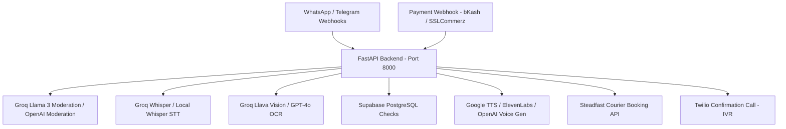

# AIReplyAgent Python Backend Microservice

This is the Python-based AI microservice backend for the **AIReplyAgent** system. It handles incoming messaging webhooks, voice transcodes, vision recognition, content moderation, geographical rules, and payment/telephony triggers.

---

## 🏗️ Architecture Design



---

## 🚀 VPS Deployment & Running

This backend is packaged in Docker for easy, isolated deployment on a VPS without conflicting with your main Nuxt.js port (Port 3000).

### Prerequisites on VPS
Ensure you have Docker and Docker Compose installed on your VPS:
```bash
sudo apt-get update
sudo apt-get install -y docker.io docker-compose
```

### Steps to Run:

1. **Navigate to the Backend Folder**:
   ```bash
   cd ai-reply-backend
   ```

2. **Configure Environment Variables**:
   Create a `.env` file based on `.env.example`:
   ```bash
   cp .env.example .env
   # Edit with your credentials
   nano .env
   ```

3. **Start the Microservice in Docker**:
   Build the image (which installs FFmpeg + dependencies) and start the service in background mode:
   ```bash
   docker-compose up --build -d
   ```

4. **Verify the Status**:
   Visit or ping the health check API:
   ```bash
   curl http://localhost:8000/api/status
   # Output: {"status":"operational","vps_mode":true,"ffmpeg_ready":true}
   ```

---

## 📡 Webhook Routing Details

* **WhatsApp Handshake & Events**: `GET /webhook/whatsapp` & `POST /webhook/whatsapp`
* **Payment Triggers**: `POST /webhook/payment`
* **Health Metrics**: `GET /api/status`

---

## 🔒 Security & Safe-to-Run
* Designed to run behind a reverse proxy (e.g., Nginx) on your VPS.
* Independent of your main project directory, preventing any resource conflicts or server timeouts.
